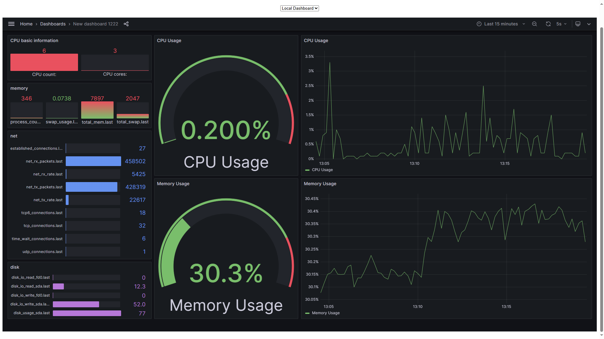

# 简介

这是一个性能监控可视化工具。
使用influxDB数据库和Grafana显示工具，支持采集分布式设备数据并进行展示。

# 文件介绍
- dash_board目录下为Grafana的dashboard配置json文件。
- pic目录下为效果展示图，包括本机性能监控和分布式设备性能监控。
- dash_display.html为性能监控窗口，头部有一个按钮可以切换到不同的设备数据。
- local_os_info_collector.sh负责采集本机数据。
- distributed_os_collector.sh负责采集分布式设备数据。
- turorial.md为influxDB和Grafana的安装和使用教程。
# 使用方法
## 本机性能监控显示
1. 安装influxDB数据库和Grafana可视化工具。（可参考turorial.md）
2. 修改local_os_info_collector.sh文件里面的数据库配置信息。
3. 在Grafana（通常是http://localhost:3000）里面添加新的dash board，导入./dash_board/dash_local.json配置文件。
4. 在dashboard里面导出链接，填入dash_display.html里面的显示地址value。
5. 完成。可点开html网页观察性能数据可视化。
## 分布式设备性能监控
1. 按上面步骤在本机搭建好性能监控显示系统。
2. 在分布式设备上运行distributed_os_collector.sh文件即可。（需修改INFLUXDB_HOST为主机IP地址）
# 可能遇到的BUG
Q：html无法显示grafana的dashboard窗口。
A：grafana的分享权限不够，需要调整其可匿名登录且可支持网页嵌入。参考[Grafana基础：集成方法之页面嵌入_grafana嵌入自己网页-CSDN博客](https://blog.csdn.net/liumiaocn/article/details/104047314)
